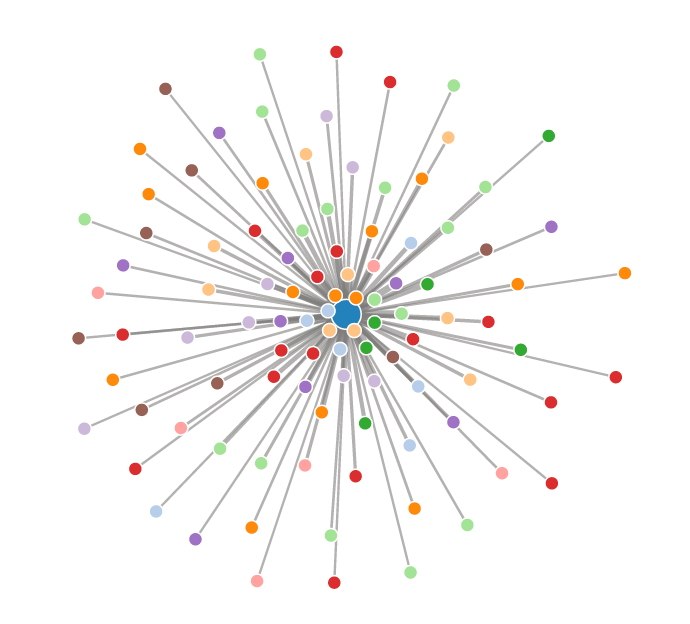
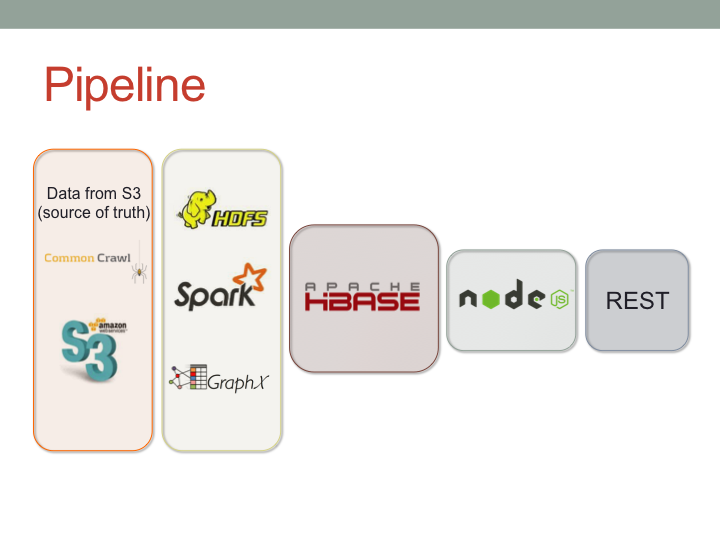

Meshwork
=======
Mesh + Network = Meshwork

[Meshwork](http://jcano.me/meshwork) is my big data project as part of [Insight Data Science](http://insightdataengineering.com/)'s Engineering fellowship program from June 2015 through July 2015.

## What is Meshwork?
If you own a website, then you own a piece of the vast internet web graph. When you look at your website's relationships (links) to other websites, then those relationships can be viewed, as what I like to call, a mesh in the internet network. So, Mesh + Network = Meshwork.

Google's 1st degree "mesh" graph

*The center node is [google.com](http://www.google.com). Surrounding it are its 1st degree neighbors. The closer the neighbors are to the center node, the higher the neighbor's Page Rank.*

## Motivation
The main purpose of the project was to gain experience in processing large amounts of data - the *volume* in the three V's (volume, velocity, variety).
The end product might be interesting for SEO analysis, to see which are the most credible websites that are affecting your own website's Page Rank.

## Intro
**Meshwork** is an open-source data pipeline which extracts and processes [Common Crawl](http://commoncrawl.org)'s web corpus, finding the [Page Rank](http://ilpubs.stanford.edu:8090/422/1/1999-66.pdf) and 1st and 2nd degree relationships of each web page in the hyperlink graph. To do this, it leverages the following technologies:

- Big Data Pipeline
    - AWS EC2 and S3
    - Apache Hadoop
    - Apache Spark and Spark GraphX
    - Apache HBase
- Front End
    - Node.js
    - jQuery
    - React

## Live Demo
A live demo is currently (July 2015) running at [http://www.jcano.me/meshwork](http://www.jcano.me/meshwork)

A screencast is available on the **Screencast** section of the above website, in case of a server downtime

## The Data
The data comes from [Common Crawl](http://commoncrawl.org)'s April 2015 web corpus. The corpus is ~168TB, but for this project, a subset of this data was processed, roughly ~445GB.

The files are available in Common Crawl's public AWS S3 bucket as gzipped WARC file formats. A WARC file contains a header for the whole file, as well as a header and body of each request and web page used and found during the crawl:

## Pipeline Overview

The WARC files were processed through a traditional ETL process, but in a distributed manner. Each worker node was responsible for downloading a gzipped WARC file and extracting the source and destination links. The links were then saved to local [HDFS](http://hadoop.apache.org), transformed to [Spark](https://spark.apache.org) [RDD](https://www.cs.berkeley.edu/~matei/papers/2012/nsdi_spark.pdf)'s, and loaded into [Spark GraphX](https://spark.apache.org/graphx/) for processing.

The results from the batch processing are stored into [HBase](https://hbase.apache.org) and served through [Node.js](https://nodejs.org) as a REST API.

## Presentation Deck
Slides are available on [Slideshare](http://www.slideshare.net/JustinCano/justin-cano-demo-50074846).

# Misc. Resources
[Insight Data Engineering Fellows Program](http://www.insightdataengineering.com)

[Awesome Data Engineering](https://github.com/igorbarinov/awesome-data-engineering)
